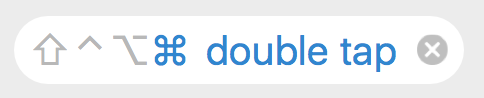

# KeyHolder
[](https://github.com/Clipy/KeyHolder/releases/latest)
[](https://github.com/Clipy/KeyHolder/blob/master/LICENSE)

Record shortcuts in macOS, like Alfred App.




## Usage
```
platform :osx, '10.9'
use_frameworks!

pod 'KeyHolder'
```

## Example
Set default key combo.
```
let recordView = RecordView(frame: CGRect.zero)
recordView.tintColor = NSColor(red: 0.164, green: 0.517, blue: 0.823, alpha: 1)
let keyCombo = KeyCombo(doubledModifiers: .CommandKeyMask)
recordView.keyCombo = keyCombo
```

Some delegate methods
```
func recordViewShouldBeginRecording(recordView: RecordView) -> Bool
func recordView(recordView: RecordView, canRecordShortcut keyCombo: KeyCombo) -> Bool
func recordViewDidClearShortcut(recordView: RecordView)
func recordViewDidEndRecording(recordView: RecordView)
```

## Dependencies
The source code is dependent on hotkey library.
- [Magnet](https://github.com/Clipy/Magnet)

### Contributing
1. Fork it ( https://github.com/Clipy/KeyHolder/fork )
2. Create your feature branch (`git checkout -b my-new-feature`)
3. Commit your changes (`git commit -am 'Add some feature'`)
4. Push to the branch (`git push origin my-new-feature`)
5. Create a new Pull Request
